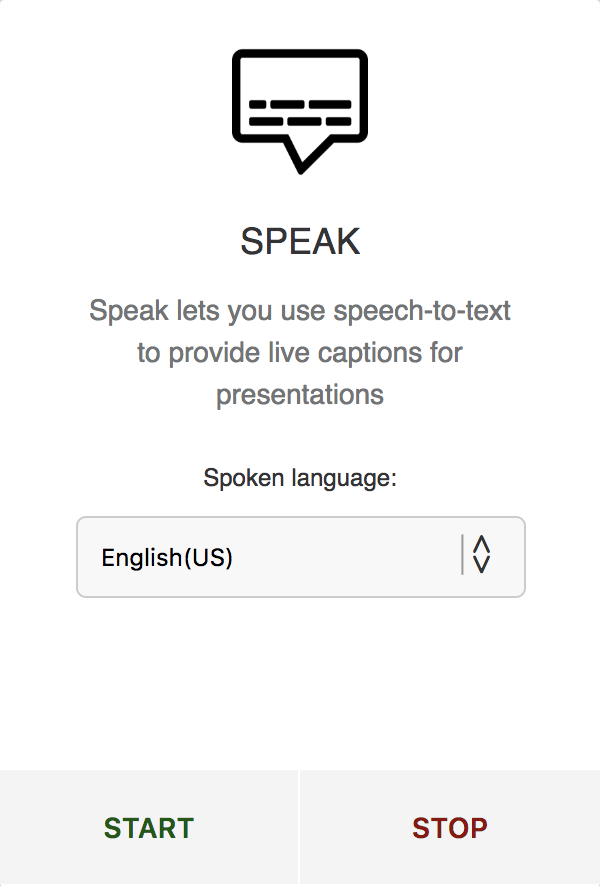
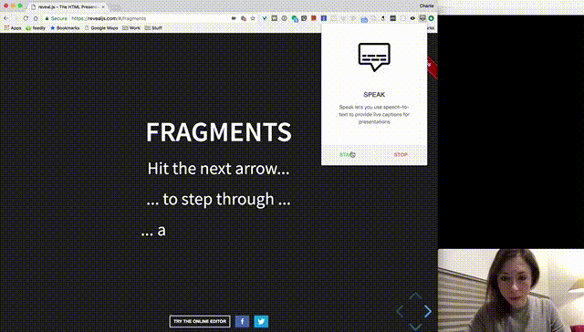

# Speak - Chrome extension

**Speak** is a Chrome extension using the Speech Recognition API to provide a speech-to-text interface as an overlay on a website.
The main goal is to allow people to make their presentations more accessible for the deaf and hard-of-hearing.

**Important note:**

*As any speech recognition system, it is not working perfectly but hopefully it can still be somehow useful and will probably improve over time.*

# Current status:

So far, seems to be working on:

* [Reveal.js](https://revealjs.com/#/)
* [MDX-deck](https://jxnblk.com/mdx-deck/#0)
* [Spectacle](https://stack.formidable.com/spectacle/#/?_k=140t3u)

It does not work on Google Slides but they now have a caption functionality implemented.

# How to install:

### As a Chrome extension:

It has now been approved by the Google Chrome team so you can [install it from the chrome web store](https://chrome.google.com/webstore/detail/speak/kafbpkaodnkapgalobfodcpbioffcngc/related?authuser=1).

### Dev version:

* Download or clone this repo.
* Go to the [Chrome extension interface](chrome://extensions/).
* Activate Developer mode (top-right corner).
* Click on the "Load unpacked" button in the menu bar.
* Select the folder where you cloned the project.

You should now see the icon of the extension in your browser extension bar.

# How to use:

* Click on the extension in your browser's menu bar.
* Select your spoken language.
* Click on the "Start" button.
* Allow access to your microphone if you haven't already.
* Detection:
  * If the website you are currently trying to use this extension on is **blocking access to AudioCapture**, you will see an **error message displayed**.
  * If you do **not see an error message**, you should be able to **start speaking** and see an overlay appear on the page with the **caption**.
* Click on the extension logo again in the menu bar to close the extension.

* To stop the tracking, open the extension and click on the "Stop" button.

**If the Speech Recognition API does not recognise what you are trying to say, it will default to English (US).**

# Example:

[Watch a video example](https://twitter.com/devdevcharlie/status/1024789897989607425)

# Languages supported:

*(I found this list in a tutorial so not 100% sure it's accurate)*

| Languages        | Region           | Language code  |
| ------------- |:-------------:| -----:|
| Afrikaans      | Default | af-ZA |
| Bahasa Indonesia      | Default      |   id-ID |
| Bahasa Melayu | Default      |    ms-MY |
| Català | Default      |    ca-ES |
| Čeština | Default      |    cs-CZ |
| Dansk | Default      |    da-DK |
| Deutsch | Default      |    de-DE |
| English | Australia      |    en-AU |
| English | Canada      |    en-CA |
| English | India      |    en-IN |
| English | New Zealand      |    en-NZ |
| English | South Africa      |    en-ZA |
| English | United Kingdom      |    en-GB |
| English | United States      |    en-US |
| Español | Argentina      |    es-AR |
| Español | Bolivia      |    es-BO |
| Español | Chile     |    es-CL |
| Español | Colombia     |   es-CO |
| Español | Costa Rica     |   es-CR |
| Español | Ecuador     |    es-EC |
| Español | El Salvador     |    es-SV |
| Español | España     |    es-ES |
| Español | Estados Unidos     |    es-US |
| Español | Guatemala     |    es-GT |
| Español | Honduras     |    es-HN |
| Español | México     |    es-MX |
| Español | Nicaragua     |    es-NI |
| Español | Panamá     |    es-PA |
| Español | Paraguay     |    es-PY |
| Español | Perú     |    es-PE |
| Español | Puerto Rico     |    es-PR |
| Español | República Dominicana     |    es-DO |
| Español | Uruguay     |    es-UY |
| Español | Venezuela     |    es-VE |
| Euskara | Default     |    eu-ES |
| Filipino | Default     |    fil-PH |
| Français | Default     |    fr-FR |
| Galego | Default     |    gl-ES |
| Hrvatski | Default     |    hr_HR |
| IsiZulu | Default     |    zu-ZA |
| Íslenska | Default     |    is-IS |
| Italiano | Italia     |    it-IT |
| Lietuvių | Default     |    lt-LT |
| Magyar | Default     |    hu-HU|
| Nederlands | Default     |    nl-NL |
| Norsk bokmål | Default     |    nb-NO |
| Polski | Default     |    pl-PL |
| Português | Brasil     |    pt-BR |
| Português | Portugal     |    pt-PT |
| Română | Portugal     |    ro-RO |
| Slovenščina | Default     |    sl-SI |
| Slovenčina | Default     |    sk-SK |
| Suomi | Default     |    fi-FI |
| Svenska | Default     |    sv-SE |
| Tiếng Việt | Default     |    vi-VN |
| Türkçe | Default     |    tr-TR |
| Ελληνικά | Default     |    el-GR |
| български | Default     |    bg-BG |
| Pусский | Default     |    ru-RU |
| Српски | Default     |    sr-RS |
| Українська | Default     |    uk-UA |
| 한국어 | Default     |    ko-KR |
| 中文 | 普通话 (中国大陆)     |    cmn-Hans-CN |
| 中文 | 普通话 (香港)     |    cmn-Hans-HK |
| 中文 | 中文 (台灣)     |    cmn-Hant-TW |
| 中文 | 粵語 (香港)     |    yue-Hant-HK |
| 日本語 | Default     |    ja-JP |
| हिन्दी | Default     |    hi-IN |
| ภาษาไทย | Default     |    th-TH |

# Tech stack:

* HTML/CSS/JS
* Speech Recognition API

# Current known issues:

* The recognition is not always very accurate

---

# To do:

- [x] Fix UI so only displays a certain number of words so it doesn't take too much space on the screen.
- [x] Support multi-language?
- [ ] Allow translation in other languages than english with Google translate? (Might be too slow...)
- [ ] Redesign

