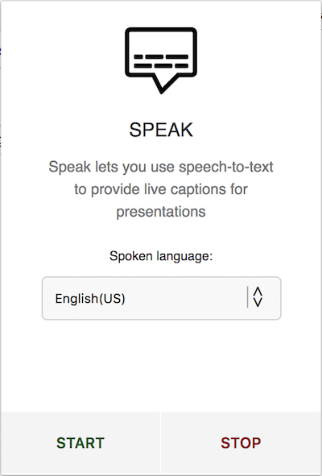

# Speak - Chrome extension

**Speak** is a Chrome extension using the Speech Recognition API to provide a speech-to-text interface as an overlay on a website.
The main goal was to allow people to make their presentations more accessible for people with hearing impairment.

**Important note:**

*As any speech recognition system, it is not working perfectly but hopefully it can still be somehow useful.*

## Example:

<video alt="demo video" controls src="./speak.mp4" width="auto"></video>

## How to install:

* Install the extension from the Chrome web store here.
* Some websites might be blocking access to your microphone so make sure you are allowing access when using the extension.

## To do:

- [ ] Fix UI so only displays a certain number of words so it doesn't take too much space on the screen.
- [x] Support multi-language?
- [ ] Allow translation in other languages than english with Google translate? (Might be too slow)

